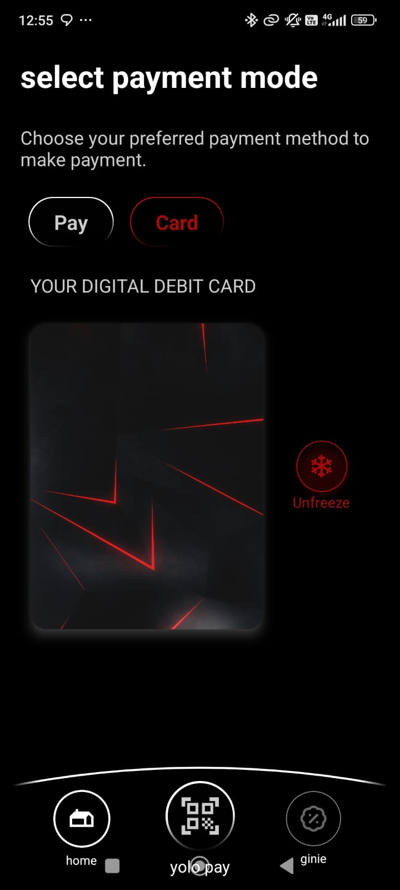
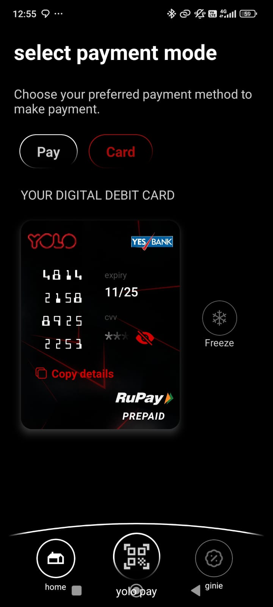

# 💳 Digital Debit Card UI – React Native

A modern, animated debit card UI built with **React Native**, inspired by a Figma design.
---

## 📱 Demo Screens

### Freeze Animation with Fog Overlay  


### Card Details UI  


---

## 🧠 What I Learned

- Replicating a Figma design using React Native layout and styles.
- Working with `ImageBackground` and `Animated` overlays.
- Using `expo-linear-gradient`, `MaskedView`, and custom fonts.
- Structuring dynamic data using `faker.js`.
- Shadow and elevation styling for iOS and Android.
- Copy-to-clipboard integration with `expo-clipboard`.

---

## 🚀 Getting Started

### 1. Clone the Repo

```bash
git clone https://github.com/Lopezzz56/payui_reactnative.git
cd payui_reactnative

2. Install Dependencies

npm install

3. Run the Project

npx expo start